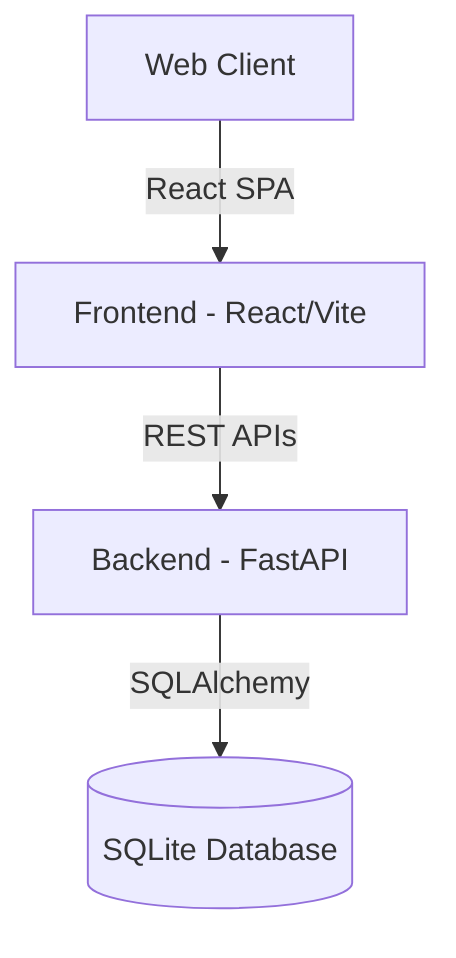

# Design Specification — Warehouse Management Portal

This document outlines the architecture, features, styling design system, and security design details of the Warehouse Management Portal.

---

## 1. System Architecture

The portal is designed as a modern decoupled Web Application:
- **Frontend**: Single Page Application (SPA) built using React (Vite environment), utilizing React Router for client-side routing, Axios for API calls, and Recharts for dashboard analytics visualization.
- **Backend**: Python FastAPI REST server providing high-performance JSON endpoints, backed by SQLAlchemy ORM.
- **Database**: SQLite Database (`warehouse.db`) storing kits, inspections, dispatch tracking logs, manpower allocations, and user profiles.

---

## 2. Key Product Modules

1. **Operations Dashboard**: Real-time analytics visualizer displaying total kits made, inspection clearance status, dispatch progress, return quantities, and manpower trends.
2. **Kits Made tracking**: Form inputs and bulk upload utilities for recording daily kit production records across different warehouse locations.
3. **Quality Assurance Inspection**: Tracks kit lots offered to QAA, inspection pass/fail status, inspection numbers, and re-queuing of failed toolkit lots.
4. **Toolkit Dispatch & Returns**: Monitors dispatches to various locations (such as India Post), tracking status transitions (`Pending For Mark`, `Already In Transit`, `Dispatched`), barcode numbers, and returned items logs.
5. **Man Power Tracking**: Log headcount allocations for permanent personnel, additional contract laborers, and supervisors, detailing overtime metrics and shift records.

---

## 3. Role-Based Access Controls (RBAC)

The portal implements strict role-based client-side constraints:

| Feature / Page | Super Admin | Admin | Warehouse Manager | Worker |
| :--- | :---: | :---: | :---: | :---: |
| **Operations Dashboard** | View All | View All | Locked to Assigned WH | Locked to Assigned WH |
| **Trade Offering & Summary** | View | View | *Hidden / Denied* | *Hidden / Denied* |
| **Excel Upload Dashboard** | View & Upload | View & Upload | *Denied* | *Denied* |
| **Kits, Inspection, Dispatch** | Read-Only | Write/Edit/Delete | Write/Edit (WH Restricted) | *Denied* |
| **Manpower Allocation** | Read-Only | Write/Edit/Delete | Write/Edit (WH Restricted) | *Denied* |
| **Warehouses Management** | Read-Only | Manage | *Denied* | *Denied* |

---

## 4. Visual Design & CSS Tokens

The visual style is defined inside [index.css](file:///d:/warehouse-management-portal/frontend/src/index.css) as a refined design system supporting both Light and Dark themes.

### CSS Variables & Palettes
- **Typography**: 
  - Titles & Headers: `Plus Jakarta Sans`, font-weight: `700` to `800`
  - Body & UI Fields: `Inter`, font-weight: `400` to `600`
- **Color Palettes**:
  - Primary Accent: Indigo-purple `#6366f1` / `#4f46e5`
  - Success Green: Teal-emerald `#10b981` / `#34d399`
  - Danger Red: `#ef4444` / `#f87171`
  - Base Backgrounds: Slate-white `#f8fafc` (light), dark midnight-navy `#090d16` (dark)

### Key Styling Details
- **Glassmorphism**: `.glass-card` uses `backdrop-filter: blur(18px)` and gradient borders.
- **Micro-interactions**:
  - Buttons scale down slightly on click (`active: scale(0.96)`) and elevate on hover.
  - Interactive elements feature smooth transition offsets (`transition: all 0.25s cubic-bezier(0.4, 0, 0.2, 1)`).
  - Active input fields display a soft outer focus shadow ring.
- **Scrollbars**: Styled as narrow capsule tracks to maintain page cleanliness.
